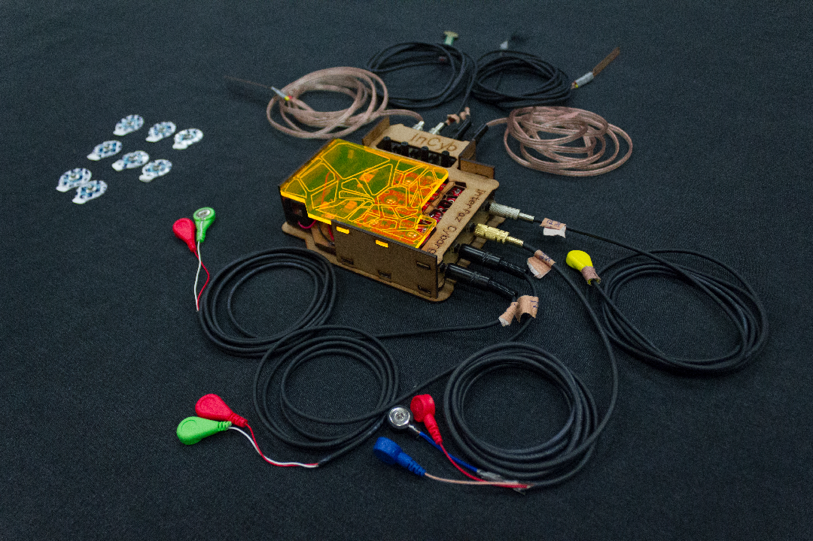

# InCY, INTERFACE CYBORG

## aka Jakinator

## physical interface for transforming the human body in the interface itself

## Team

### JOAQUÍN ROBERTO DÍAZ DURÁN

> PhD Researcher at Universidad Carlos III de Madrid

### MARTA TIMÓN

> M.C.S.

### PEDRO LÓPEZ

> Ing. En Electrónica

> Joakinator beta

Key Words
Interfaz corporal, Arte Ciborg, Performance, Propiocepción, Adaptar la tecnología al artista, dialogo con el otro, HCI

Joakinator is an interaface devoted to convert the languaje and signs of the human body in the interface itslef. The idea behind Joakinator is giving direct control of the multimedia elements to the artist, but this elements are not just controlled by the artist, in fact the artist also receive cues from the system. Joakinator will be a creative assistant in the creation proces of a performance.

## Skematics

## Code

## CAD DESIGN

## Getting started

Protocolo de conexión Joakinator

1. Abrir el hostspot del teléfono
2. Conectar las computadoras al hostspot y revisar su dirección IP
3. Configurar el archivo secrets.h y la parte de las direcciones IP en el programa de Arduino
4. Cargar las modificaciones al Arduino del Joakinator
5. Desconectar el cable USB y colocar las baterías. Esperar a que el led amarillo se encienda, eso significa que se ha conectado a la WLAN
6. Abrir el programa de Processing y ejecutarlo
   a. Barras blancas son las señales del Joakinator
   b. Las barras naranjas son las señales del Wekinator
7. Ver que las barras blancas vibren, si no es así resetear el Joakinator
8. Abrir Wekinator Input_helper
   a. Comprobar los puertos
9. Abrir Wekinator
   a. Comprobar los puertos
10. Abrir MAX/MSP

Protocolo de montaje del Joakinator en cuerpo

1. Seleccionar el musculo sobre el que se montara el electrodo
2. Identificar la parte central del musculo y la parte distal
3. Limpiar con alcohol o agua oxigenada las tres áreas donde se colocarán los electrodos
4. Colocar los tres electrodos en sus posiciones
   a. Rojo es la referencia
   b. Amarillo es el middle muscle
   c. Verde es el end muscle
5. Colocar la referencia general, el electrodo de un solo plug
6. Colocar los cables con los sensores flexiforce
7. Calibrar la sensibilidad de los flexiforce con los knobs
   Nota. Los Jack del lado grande del Joakinator son para los electrodos y los que están con lo knobs son para los flexiforce

## Performance using Joakinator

  

> El equilibrio reside en 3 puntos
> Festival Ctrl Art Supr, Madrid, Marzo, 2019

- [Link](https://arterobotico.com/el-equilibrio-reside-en-3-puntos/)

  

> Interfaz Cyborg para reflexionar la tecnología
> Encuentro Si fuese Tú, Facultad de Bellas Artes de Cuenca, UCLM, Abril, 2019

- [Link](https://arterobotico.com/interfaz-ciborg-para-reflexionar-la-tecnologia/)

## Agradecimientos

 
 

- Suported by BODYinTRANSIT Sensory-driven Body Transformation Experiences On-the-move. UC3M.
- With the collaboration of FUZZYGAB.4. UCLM
- Project developed with the funding of CONACYT-FINBA. México; Medialab-Matadero. España."
