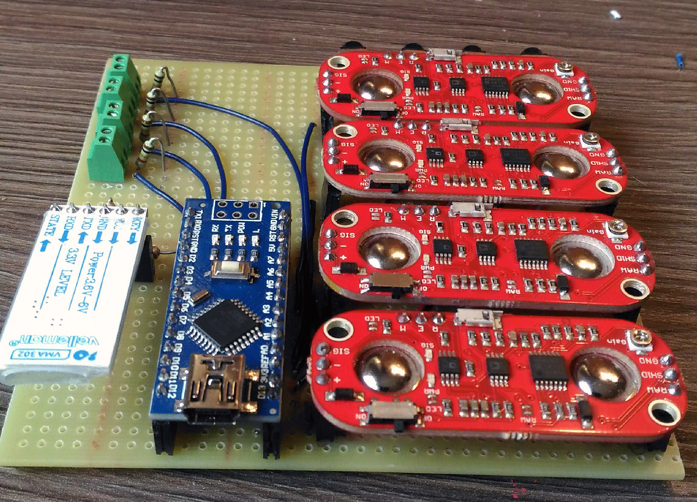

 # JOAKINATOR 
 ## physical interface for transforming the human body in the interface itself

> Joakinator alpha

Key Words
Interfaz corporal, Arte Ciborg, Performance, Propiocepción, Adaptar la tecnología al artista, dialogo con el otro, HCI

Joakinator is an interaface devoted to convert the languaje and signs of the human body in the interface itslef. The idea behind Joakinator is giving direct control of the multimedia elements to the artist, but this elements are not just controlled by the artist, in fact the artist also receive cues from  the system. Joakinator will be a creative assistant in the creation proces of a performance.

## Skematics

## Code

## Performanca using Joakinator

  

> El equilibrio reside en 3 puntos
> Festival Ctrl Art Supr, Madrid, Marzo, 2019
* [Link](https://arterobotico.com/el-equilibrio-reside-en-3-puntos/)
 

  

> Interfaz Cyborg para reflexionar la tecnología
> Encuentro Si fuese Tú, Facultad de Bellas Artes de Cuenca, UCLM, Abril, 2019
* [Link](https://arterobotico.com/interfaz-ciborg-para-reflexionar-la-tecnologia/)
