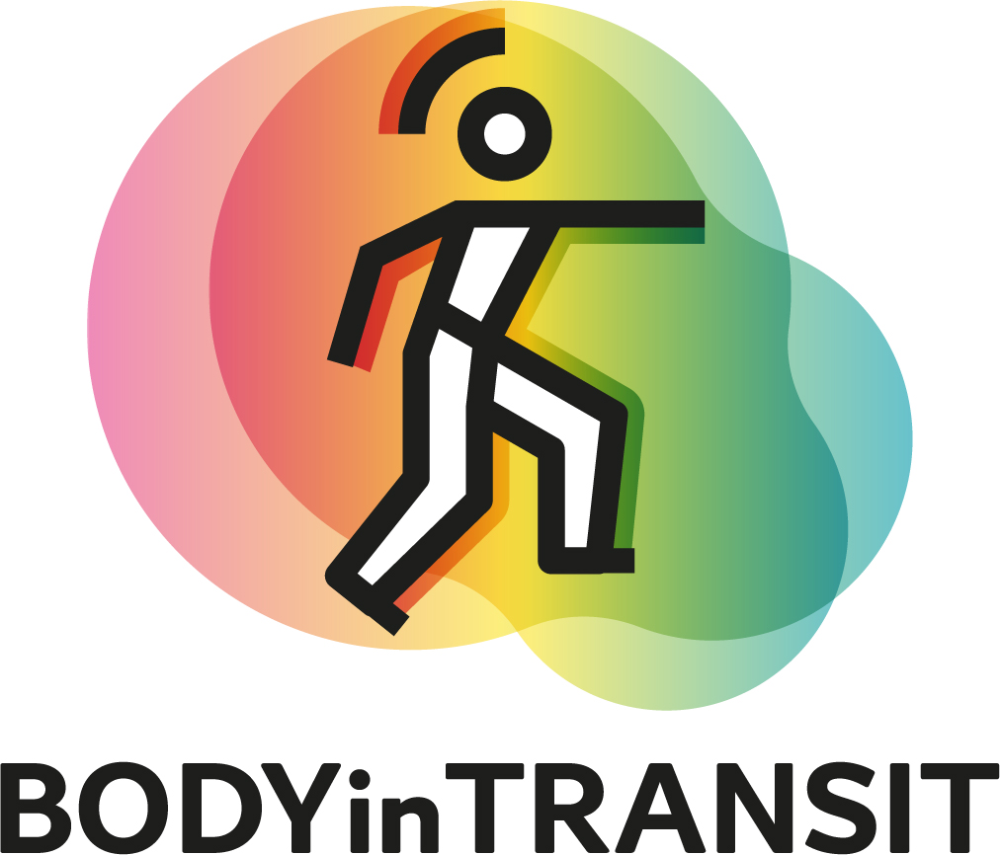
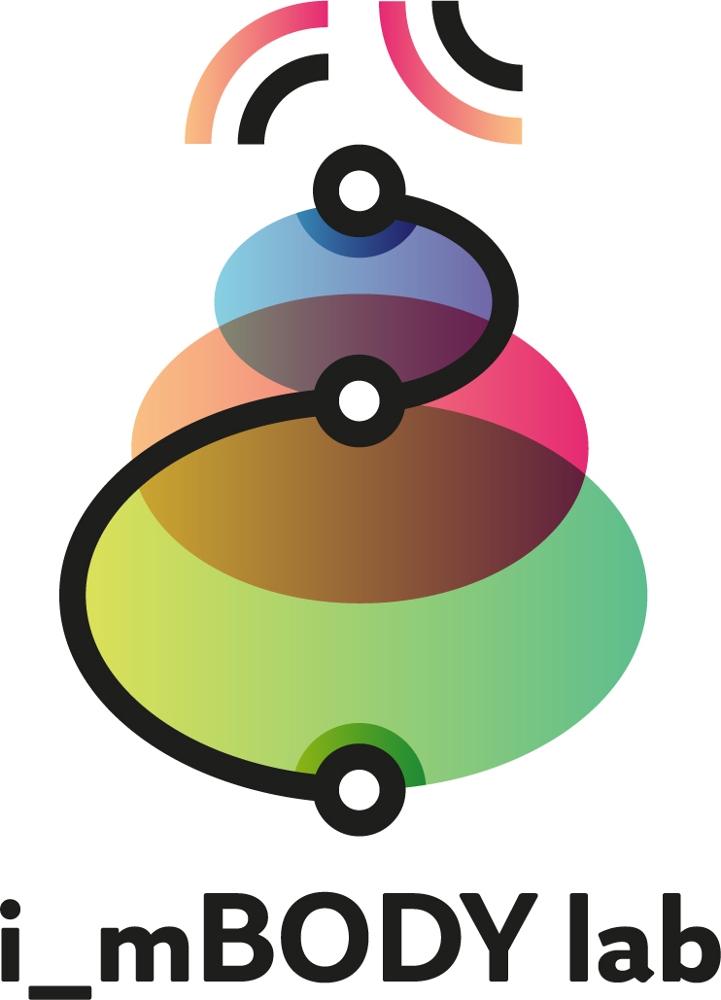
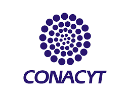
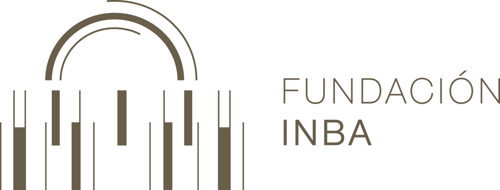

# Taller Interfaz Cyborg

### Interfaz Interactiva para reflexionar la relación arte, tecnología y cuerpo en la performance.

## Imparten

### Marta Timón & Joaquín Díaz-Durán

En este taller exploraremos las bases que hacen posible el funcionamiento del dispositivo Joakinator, además aprenderemos mediante la metodología Hands On como inicializar el sistema.

En la segunda parte del taller los asistentes experimentarán con el dispositivo Joakinator y un set de sonidos para el mismo.

### Archivos de Audio

Estos archivos son necesarios para el funcionamiento del proyecto de audio y estan basados en la performace Interfaz Cyborg: This is not your body!!! (Joaku de Sotavento, 2021).

[Descargalos](https://drive.google.com/drive/folders/1cmS-8iHkXmhXxJrSnnTvfZdne8VEqcJr?usp=sharing)

## Slides

Aquí encontraras el [contenido del workshop](https://docs.google.com/presentation/d/1TfPGoWbZKXpSUWjrv5Y0VLnvYOCxZb2MFB6kBpDMP4w/edit?usp=sharing)

## Agradecimientos

 
 

- Suported by BODYinTRANSIT Sensory-driven Body Transformation Experiences On-the-move, MagicShoes and i_mBODY Lab at UC3M.
- With the collaboration of FUZZYGAB.4. UCLM.
- Project developed with the funding of CONACYT-FINBA. México; Medialab-Matadero. España."
